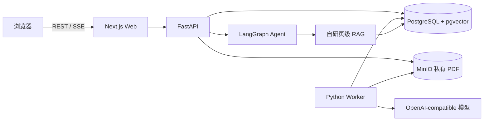

# PaperLeaf

PaperLeaf 是一个面向科研阅读的开源个人文献库。它把 PDF 保存、页级检索、带原文页码的问答、论文总结和结构图放在同一个工作台中，并通过受控 Agent 协调文库检索与 arXiv 搜索。

> 当前版本处于早期开发阶段。建议先在本机或受控网络中部署，并在升级前备份数据库与对象存储。


## 功能

- 上传、保存、查看、修改和删除 PDF 文献
- 文献列表、元数据编辑、处理状态和用户范围内的全文检索
- 按物理页解析与切块，回答附带可跳转的页码证据
- 向量检索、关键词检索与 RRF 融合，不依赖一键式 RAG Chain
- 使用 LangGraph 编排有界条件路由、人工确认、持久恢复与引用校验
- 搜索 arXiv，并在用户确认后导入开放 PDF
- 后端 API 生成论文总结和带证据的结构图
- 管理员创建、停用用户；默认不读取用户文献内容
- 未配置模型时仍可使用文献管理和 PDF 阅读功能

当前 `0.1.x` 的公开 `/demo` 使用固定文献和模拟 AI，便于在不上传文件、不配置模型的情况下检查工作流。Docker Compose 构建固定使用 `real` 数据模式并连接 FastAPI；总结与结构图目前通过 API 提供，前端入口仍在完善。

## 快速开始

### 环境要求

- Docker Engine 24+ 与 Docker Compose v2
- 至少 4 GB 可用内存；处理大 PDF 或运行本地模型时需要更多资源

### 启动

```bash
git clone https://github.com/FrostWane/PaperLeaf.git
cd PaperLeaf
cp .env.example .env
```

Windows PowerShell 可使用：

```powershell
Copy-Item .env.example .env
```

打开 `.env`，至少替换以下值：

- `POSTGRES_PASSWORD`
- `MINIO_ROOT_PASSWORD`
- `PAPERLEAF_SESSION_SECRET`
- `PAPERLEAF_BOOTSTRAP_ADMIN_EMAIL`
- `PAPERLEAF_BOOTSTRAP_ADMIN_PASSWORD`

然后启动：

```bash
docker compose up -d --build
docker compose ps
```

访问：

- Web：<http://localhost:3000>
- API 健康检查：<http://localhost:8000/health>
- MinIO 控制台：<http://localhost:9001>

首次启动会自动执行数据库迁移、创建私有 PDF Bucket，并根据环境变量创建管理员。查看日志：

```bash
docker compose logs -f api worker web
```

## 配置 AI

PaperLeaf 使用 OpenAI-compatible 接口，既可以连接云端模型，也可以连接提供兼容接口的本地服务。核心变量如下：

| 变量 | 说明 |
|---|---|
| `PAPERLEAF_OPENAI_API_KEY` | 服务端 API Key；不要以 `NEXT_PUBLIC_` 开头 |
| `PAPERLEAF_OPENAI_BASE_URL` | 兼容接口根地址 |
| `PAPERLEAF_CHAT_MODEL` | 问答与总结模型 |
| `PAPERLEAF_EMBEDDING_MODEL` | 向量模型 |
| `PAPERLEAF_EMBEDDING_DIMENSIONS` | 向量维度，必须与模型输出一致 |
| `PAPERLEAF_VISION_MODEL` | 可选；低文本页 OCR 使用的视觉模型 |

修改嵌入模型或维度后，需要对既有文献重新建立索引。未配置 API Key 时，生产环境不会把文献发送给任何模型：系统保留全文检索、引用校验和提取式产物，但不会生成向量、调用模型回答或执行视觉 OCR。

完整环境变量和生产部署注意事项参见[部署指南](docs/deployment.md)。

## 基本使用

1. 管理员登录后在“管理”页面创建普通用户。
2. 在“文献库”上传 PDF，等待状态变为“索引就绪”。
3. 打开文献，在阅读器右侧提问；点击回答后的引用可跳转到对应物理页。
4. 在“全库问答”中选择单篇、多篇或全库范围。
5. 在“发现”中搜索 arXiv；PaperLeaf 只会在确认后创建导入任务。
6. 解析失败时可查看可公开的错误信息并重试任务。

扫描版 PDF 需要配置视觉模型才能补充 OCR。未配置 OCR 时，原始 PDF 仍可保存和阅读，但检索覆盖可能不完整。

## 数据与隐私

- PDF 原件保存在私有 MinIO Bucket 中，不公开对象地址。
- 数据库保存文献元数据、页文本、检索块、向量、后台任务和 LangGraph Checkpoint。
- 模型 Key 只由 API/Worker 读取，不下发浏览器。
- 管理员负责账号和任务管理，默认没有读取用户 PDF 与提问内容的产品入口。
- 启用外部模型会把完成当前请求所需的文本证据或 OCR 页面图像发送给相应提供方，请结合其数据政策自行判断。
- PaperLeaf 不用于绕过付费墙，只导入用户上传或允许来源中的开放文件。

部署者应配置 HTTPS、强密码、备份、最小化网络暴露和符合所在地区要求的数据保留策略。详细边界参见[安全说明](docs/security.md)。

## 当前限制

- V1 只内置 arXiv 搜索，不支持任意网页抓取。
- 暂不支持 Zotero 同步、RIS/BibTeX、团队协作批注和原生移动端。
- OCR、问答和向量质量取决于所配置模型。
- 引用校验可以降低伪造引用风险，但不能替代阅读原文和科研判断。
- 大型 PDF、复杂公式、双栏排版和扫描质量会影响解析效果。

## 本地开发与测试

前端：

```bash
corepack enable
pnpm install --frozen-lockfile
pnpm lint
pnpm typecheck
pnpm test
pnpm build
pnpm storybook:build
pnpm exec playwright install chromium
pnpm test:e2e
```

后端：

```bash
cd backend
python -m venv .venv
python -m pip install -e ".[dev]"
python -m compileall paperleaf_api tests
ruff check paperleaf_api tests
pytest
```

容器配置：

```bash
docker compose --env-file .env.example config --quiet
# 启动服务并在 .env 中配置管理员后，可执行临时数据闭环
python scripts/smoke_compose.py
```

测试策略、场景与质量门禁参见[测试指南](docs/testing.md)。

## 架构



进一步了解数据流、权限边界和 Agent 设计，请阅读[架构说明](docs/architecture.md)。

## 文档

- [架构说明](docs/architecture.md)
- [部署指南](docs/deployment.md)
- [测试指南](docs/testing.md)
- [安全说明](docs/security.md)
- [贡献指南](docs/contributing.md)
- [更新记录](docs/changelog.md)

## 参与贡献

欢迎提交可复现的问题、文档修正、测试和功能改进。提交代码前请先阅读[贡献指南](docs/contributing.md)，并确保前后端测试通过。

## 许可证

PaperLeaf 基于 [Apache License 2.0](LICENSE) 发布。依赖项和字体遵循各自许可证。
