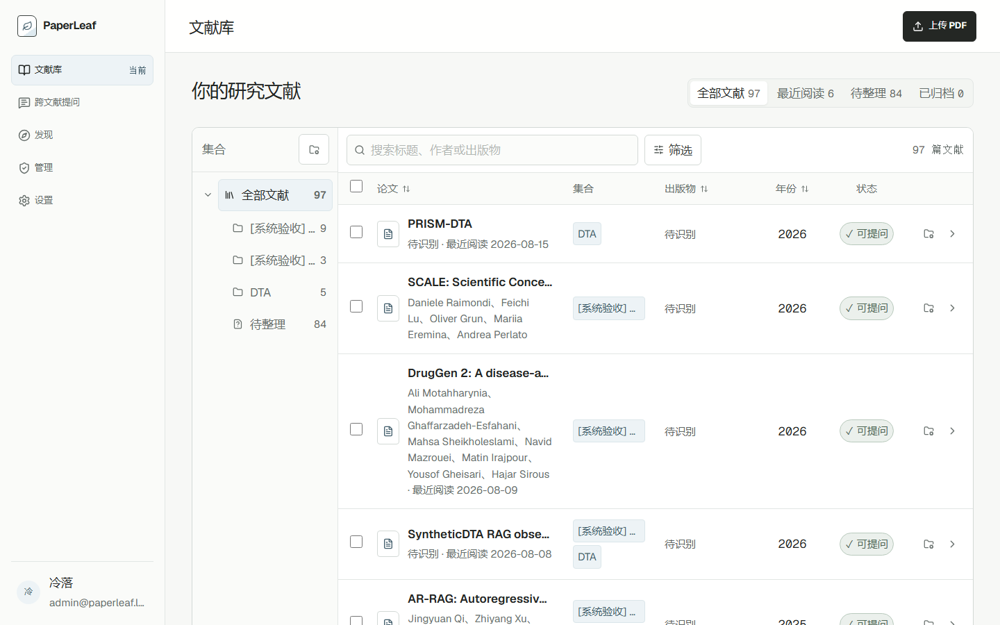
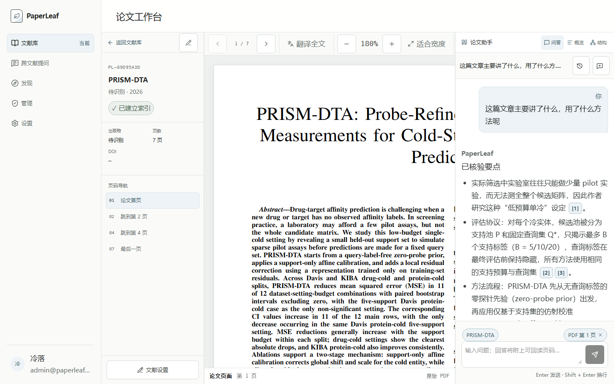
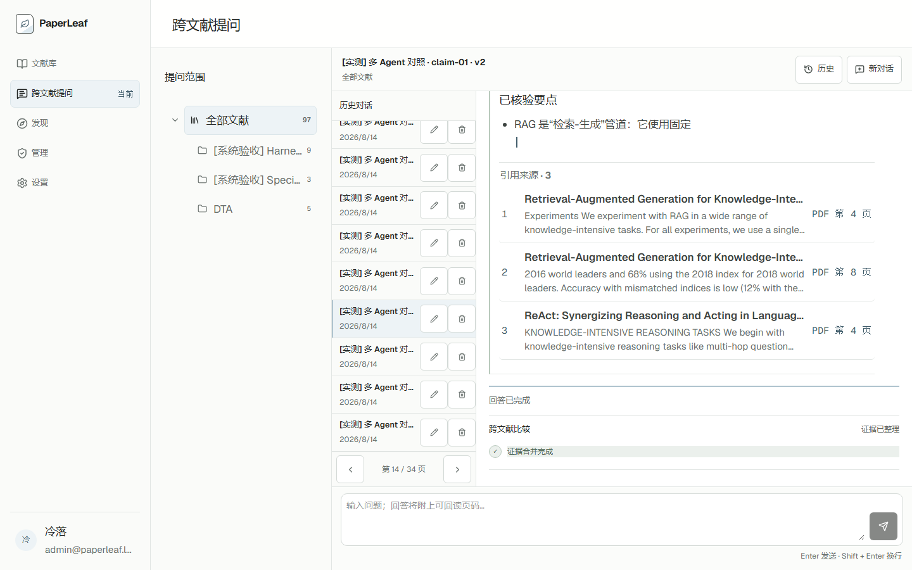
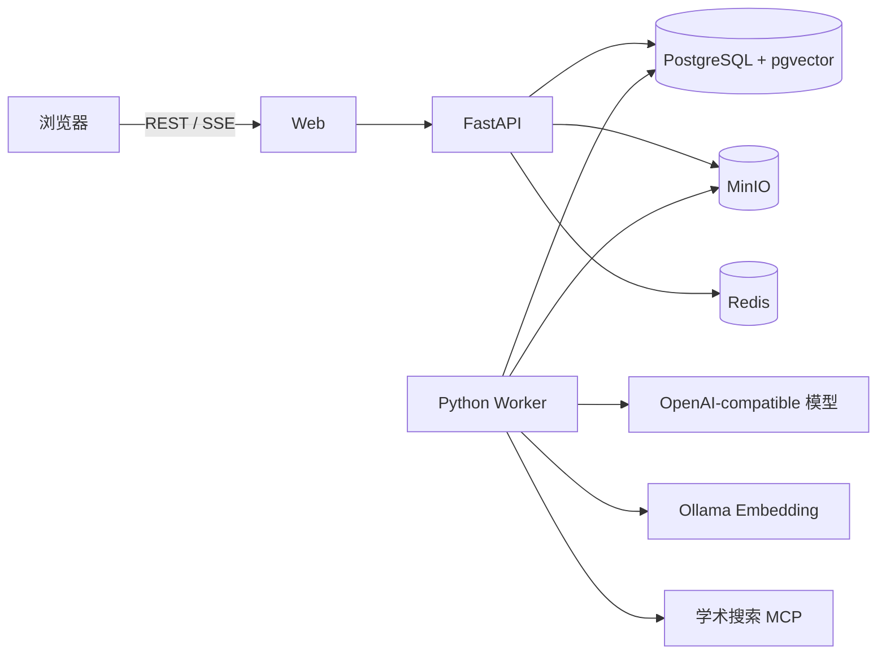

# PaperLeaf

[](https://github.com/FrostWane/PaperLeaf/actions/workflows/ci.yml)
[](https://github.com/FrostWane/PaperLeaf/releases)
[](LICENSE)

PaperLeaf 是一个可自托管的科研文献管理与阅读系统。它将 PDF 存储、层级文献库、页级检索、带原文引用的 AI 问答、全文翻译、论文概括和跨文献研究整合在同一个工作台中。

```text
上传 PDF → 解析物理页 → 建立全文与向量索引 → 阅读与检索
→ 单篇/跨文献问答 → 引用跳页 → 总结、翻译与研究结构图
```

| 文献库 | 带页码回答 | 跨论文协作轨迹 |
|---|---|---|
|  |  |  |

## 核心能力

### 文献管理

- 上传、保存、查看、编辑、归档和删除 PDF。
- 使用父子集合组织文献，一篇论文可以归入多个集合。
- 自动识别标题、作者、年份、DOI 和出版物，缺失出版物时可通过 Crossref 补全公开元数据。
- 支持批量归类、批量归档以及重新识别和索引。
- 文献列表每页展示 20 篇，筛选与集合切换后自动回到有效页码。
- 使用 MinIO 保存 PDF 原件，PostgreSQL 保存元数据、页文本、任务和会话。

### 阅读工作台

- PDF、文献资料和论文助手三栏布局，两侧面板可以单独收起。
- 支持切页、50%～200% 缩放、适合宽度和专注阅读。
- 选中 PDF 原文后可以直接提问，服务端会重新核验选文所在论文和物理页。
- 全文翻译按页在 Worker 中执行，离开页面后任务继续运行，返回后恢复进度。

### RAG 与 AI 问答

- 按物理页解析 PDF，Chunk 不跨页，引用可以跳回对应 PDF 页。
- 结合 PostgreSQL 全文检索、pgvector 向量检索和 RRF 融合召回。
- 多论文问题按论文独立取证并轮转合并，避免单篇论文占满 Top-5。
- 弱结果才触发补充查询；向量索引使用论文标题、章节、物理页和原始 Chunk 正文。
- Embedding 不可用或索引契约不匹配时自动降级为关键词检索。
- 单篇、集合和全库问答共用持久化会话，页面关闭或 SSE 断线不会取消后台任务。
- 服务端校验引用的论文、Chunk 和物理页，并对事实主张执行分批证据支持核验。
- 回答支持 Markdown、逐步流式展示和引用来源列表。

### Agent Harness

- 使用 LangGraph 编排持久化 Agent Run、人工确认、取消、恢复和后台执行。
- Context Engine 管理当前论文、页码、选文、最近对话、摘要和 Token 预算。
- Skill Registry 按需加载论文问答、原文定位、跨文献比较、主张核验、论文发现、总结和研究图等能力。
- Function Calling 只能调用经过类型、权限、范围、超时和步骤预算校验的工具。
- 实验性的 Specialist v3 默认关闭；显式启用后，它会把 3～10 篇论文的复杂比较拆成最多三个隔离分支，再确定性合并证据。
- 跨论文冲突不会被覆盖；系统保留 `support / contradict / uncertain` 证据并按论文和实验条件组织回答。
- PostgreSQL Checkpoint 与 Job 租约支持 Worker 故障接管；已经完成的 Specialist 分支不会重复执行。

### 学术搜索与可观测性

- 可通过受控 MCP 服务检索 OpenAlex 和 Semantic Scholar 公开元数据。
- 外部元数据不会冒充已读取的论文正文；需要全文问答时仍须确认导入并完成索引。
- 管理员可以查看 RAG 召回通道、意图、失败率、耗时、引用与主张支持情况。
- Harness 页面聚合 Context、Memory、Skill、Tool、MCP、分支耗时、Token、证据数、冲突数和回退原因。
- Prometheus 与 Grafana 提供容量和运行指标，不记录用户问题、论文正文或隐藏推理。

### 用户与权限

- 首次启动创建管理员，管理员再创建普通用户和临时密码。
- 普通用户只能访问自己的文献、集合、会话、Agent Run 和产物。
- 管理员负责用户、配额和任务管理，产品界面默认不提供读取用户 PDF 与聊天正文的入口。
- 用户可以保存字号、PDF 缩放、侧栏、翻译语言、联网搜索和长期记忆偏好。

## 技术架构

| 层级 | 主要技术 |
|---|---|
| Web | Next.js App Router、React、TypeScript、Tailwind CSS、TanStack Query、Zustand |
| PDF 与交互 | PDF.js、react-pdf、Radix UI、Mermaid |
| API | FastAPI、Pydantic、SQLAlchemy Async、Alembic |
| Agent | LangGraph、Function Calling、SSE、PostgreSQL Checkpointer |
| RAG | PyMuPDF、PostgreSQL 全文检索、pgvector、RRF |
| 异步任务 | PostgreSQL Job Queue、Python Worker、租约与 claim token fencing |
| 存储 | PostgreSQL、MinIO、Redis |
| 观测 | Prometheus、Grafana、应用内 RAG/Harness 聚合指标 |
| 测试 | Pytest、Vitest、Testing Library、Playwright、axe-core、Lighthouse CI |



## 快速开始

### 环境要求

- Git
- Docker Engine 24+ 或 Docker Desktop
- Docker Compose v2
- 至少 4 GB 可用内存
- 可选：OpenAI-compatible 聊天模型、Ollama 和学术数据库 API Key

### 1. 获取代码

```bash
git clone https://github.com/FrostWane/PaperLeaf.git
cd PaperLeaf
cp .env.example .env
```

Windows PowerShell：

```powershell
Copy-Item .env.example .env
```

### 2. 设置基础配置

打开 `.env`，至少替换以下值：

```dotenv
POSTGRES_PASSWORD=使用URL安全字符的数据库密码
MINIO_ROOT_PASSWORD=对象存储密码
PAPERLEAF_SESSION_SECRET=至少64位随机字符串
PAPERLEAF_BOOTSTRAP_ADMIN_EMAIL=你的管理员邮箱
PAPERLEAF_BOOTSTRAP_ADMIN_PASSWORD=管理员初始密码
GRAFANA_ADMIN_PASSWORD=Grafana管理员密码
```

本地 HTTP 使用：

```dotenv
PAPERLEAF_MODE=development
PAPERLEAF_BIND_ADDRESS=127.0.0.1
PAPERLEAF_SECURE_COOKIES=false
NEXT_PUBLIC_API_BASE_URL=http://localhost:8000/api/v1
```

公网部署必须配置 HTTPS，并将 `PAPERLEAF_SECURE_COOKIES` 改为 `true`。

### 3. 启动服务

```bash
docker compose up -d --build
docker compose ps
```

所有核心服务应处于 `running` 或 `healthy`。首次启动会自动：

1. 创建 PostgreSQL 数据结构；
2. 创建私有 MinIO Bucket；
3. 创建初始管理员；
4. 启动 API、Worker、Web、Redis 和观测服务。

访问地址：

| 服务 | 地址 |
|---|---|
| PaperLeaf | <http://localhost:3000> |
| API 存活检查 | <http://localhost:8000/health> |
| 依赖与 Worker 就绪检查 | <http://localhost:8000/ready> |
| MinIO 控制台 | <http://localhost:9001> |
| Prometheus | <http://localhost:9090> |
| Grafana | <http://localhost:3001> |

### 4. 首次登录

使用 `.env` 中的 `PAPERLEAF_BOOTSTRAP_ADMIN_EMAIL` 和 `PAPERLEAF_BOOTSTRAP_ADMIN_PASSWORD` 登录。

管理员可以直接使用系统，也可以进入“管理 → 用户与权限”创建普通用户。普通用户使用临时密码首次登录时需要设置新密码。

## 使用教程

### 建立文献库

1. 进入“文献库”，创建需要的父集合和子集合。
2. 点击“上传 PDF”，选择一个或多个目标集合。
3. 等待论文状态变为“索引就绪”。
4. 如果标题、作者、年份或出版物识别不完整，打开“文献设置”进行修改或重新处理。
5. 已有多篇论文需要重新向量化时，在文献库勾选论文，执行“重新识别与索引”。

重新索引会复用 MinIO 中的原始 PDF，不需要再次上传。重新解析后，旧的概括、结构图和向量产物会被标记为过期。

### 阅读与选文提问

1. 点击论文标题进入阅读工作台。
2. 使用顶部工具栏切页、缩放或进入专注阅读。
3. 在 PDF 文字层拖选一段原文。
4. 右侧输入问题，例如“这段为什么这样处理？”或“这里的实验设置有什么作用？”。
5. 发送后选文会作为本次消息附件提交；回答中的引用可以跳回相应物理页。

扫描型 PDF 需要配置视觉模型才能补充 OCR。未配置 OCR 时仍可保存和阅读 PDF，但文本检索和选文能力可能不完整。

### 单篇问答、概括与结构图

在论文助手中可以：

- 新建、重命名和删除会话；
- 询问论文的问题、方法、实验、结果和局限；
- 生成带引用的中文论文概括；
- 生成“研究问题 → 方法 → 实验 → 结果 → 局限”结构图；
- 点击任意引用回到 PDF 物理页。

Agent Run 由 Worker 在后台执行。切换页面不会终止任务，再次进入时会恢复状态和已经生成的消息。

### 跨文献问答

1. 进入“跨文献提问”。
2. 选择“全部文献”或某个集合；父集合会递归包含子集合文献。
3. 提问，例如“比较这些论文的方法、实验设置和局限，并指出结论冲突”。
4. 系统会冻结本次论文范围，检索各论文证据并生成统一回答。

当启用 Specialist 子图且范围包含 3～10 篇论文时，复杂比较会拆分为最多三个独立分支。普通单篇问题和简单检索仍走开销更低的标准链路。

### 全文翻译

1. 在阅读器顶部点击“翻译全文”。
2. 确认目标语言和页数。
3. 阅读区切换为“原始 PDF + 译文”双栏。
4. 当前页优先翻译，其余页面由 Worker 继续处理。

翻译基于已经解析的页文本，不会生成或修改原始 PDF。公式、引用编号和专有名词会尽量保留。

### 发现与导入论文

1. 在个人设置中开启“允许联网学术搜索”。
2. 在“发现”查看基于当前文献库生成的相关论文。
3. 点击“换一批”获取下一批候选，并使用感兴趣/不感兴趣反馈调整后续排序。
4. 导入前确认论文信息；PaperLeaf 只会在确认后创建下载与解析任务。

也可以在问答中要求检索 OpenAlex、Semantic Scholar 或 arXiv。外部结果只提供公开元数据；未导入 PDF 前不能作为论文正文证据。

## 配置 AI 服务

PaperLeaf 将聊天生成与向量检索视为两项独立能力。只配置聊天模型时，系统仍可使用 PostgreSQL 全文检索完成 RAG；配置 Embedding 后才会增加语义向量召回。

### DeepSeek 聊天模型

```dotenv
PAPERLEAF_OPENAI_API_KEY=你的DeepSeekKey
PAPERLEAF_OPENAI_BASE_URL=https://api.deepseek.com
PAPERLEAF_CHAT_MODEL=填写当前可用的聊天模型

# DeepSeek 聊天接口不承担向量化
PAPERLEAF_EMBEDDING_ENABLED=false
```

修改后重建：

```bash
docker compose up -d --build api worker web
```

### Ollama 本地向量模型

先在宿主机安装并启动 Ollama：

```bash
ollama pull qwen3-embedding:0.6b
ollama serve
```

Docker Desktop 通过 `host.docker.internal` 访问宿主机 Ollama：

```dotenv
PAPERLEAF_FALLBACK_OPENAI_API_KEY=ollama
PAPERLEAF_FALLBACK_OPENAI_BASE_URL=http://host.docker.internal:11434/v1
PAPERLEAF_FALLBACK_CHAT_MODEL=
PAPERLEAF_FALLBACK_EMBEDDING_ENABLED=true
PAPERLEAF_FALLBACK_EMBEDDING_MODEL=qwen3-embedding:0.6b

PAPERLEAF_EMBEDDING_PROVIDER=fallback
PAPERLEAF_EMBEDDING_DIMENSIONS=1024
PAPERLEAF_EMBEDDING_INDEX_REVISION=1
PAPERLEAF_EMBEDDING_BATCH_SIZE=8
```

然后执行：

```bash
docker compose up -d --build api worker
```

进入文献库，对已有论文执行“重新识别与索引”。向量模型、维度或索引修订发生变化时，旧索引会变为过期状态，在重新索引完成前自动使用关键词检索。

### Context、Memory、Skill 与多 Agent

这些功能默认关闭，可以按阶段启用：

```dotenv
PAPERLEAF_CONTEXT_ENGINE_ENABLED=true
PAPERLEAF_MEMORY_ENABLED=true
PAPERLEAF_SKILLS_ENABLED=true
PAPERLEAF_FUNCTION_TOOLS_ENABLED=true
PAPERLEAF_MULTI_AGENT_ENABLED=true
PAPERLEAF_SPECIALIST_AGENTS_ENABLED=true
```

- Context Engine 负责多轮指代、当前页、选文和 Token 预算。
- Memory 只保存用户可查看和删除的研究偏好与固定背景。
- Skill 与 Function Tools 提供受控工具选择。
- `MULTI_AGENT` 启用确定性并行 Map-Reduce 检索。
- `SPECIALIST_AGENTS` 对符合条件的复杂跨文献任务优先使用隔离 Specialist 子图。

修改后重建 API 和 Worker。管理员可在“Agent Harness”查看实际采用的编排版本、分支耗时和回退原因。

### OpenAlex 与 Semantic Scholar

```dotenv
PAPERLEAF_MCP_ENABLED=true
OPENALEX_API_KEY=你的OpenAlexKey
SEMANTIC_SCHOLAR_API_KEY=可选
```

```bash
docker compose up -d --build academic-search-mcp api worker
```

然后进入“管理 → Agent Harness”，检测学术搜索连接并刷新工具列表。普通用户不能修改 MCP 地址，服务端只连接配置的白名单服务。

## 日常运维

### 查看状态和日志

```bash
docker compose ps
docker compose logs -f api worker web
docker compose logs --tail 200 worker
```

### 修改配置后重建

```bash
docker compose up -d --build api worker web
```

### 更新代码

升级前先备份 PostgreSQL 与 MinIO 数据，然后执行：

```bash
git pull --ff-only
docker compose up -d --build
docker compose ps
```

数据库迁移由 `migrate` 服务自动执行。不要删除 `postgres-data` 和 `minio-data` 命名卷。

### 停止服务

```bash
docker compose stop
```

`docker compose down` 会删除容器和网络，但默认保留命名卷。除非确认不再需要全部数据，否则不要使用 `down -v`。

## 常见问题

### 登录时显示 Failed to fetch

依次检查：

```bash
docker compose ps
docker compose logs --tail 100 api web
```

确认 API 为 `healthy`，并检查 `.env` 中：

```dotenv
NEXT_PUBLIC_API_BASE_URL=http://localhost:8000/api/v1
PAPERLEAF_CORS_ORIGINS=http://localhost:3000,http://127.0.0.1:3000
```

修改 `NEXT_PUBLIC_*` 后必须重新构建 Web。

### 论文一直停留在处理中

```bash
docker compose logs --tail 200 worker
```

在管理页面查看后台任务的失败原因。网络、模型或 OCR 暂时不可用时，可以重试任务；解析数据异常时，对论文执行重新处理。

### 已安装 Ollama，但没有向量召回

确认以下条件同时满足：

1. Ollama 正在运行；
2. 容器能访问 `host.docker.internal:11434`；
3. Embedding Provider、模型和维度配置一致；
4. 修改配置后已经重建 API 与 Worker；
5. 既有论文已经重新索引。

管理员的“AI 能力状态”和“向量索引契约”会显示当前模型、可用索引和关键词降级次数。

### 问答完成较慢

全文概括、结构图、跨论文比较和逐条证据核验可能产生多次模型调用。可以在管理页面查看回答、分支、合并和最终核验耗时；不需要多 Agent 时关闭 `PAPERLEAF_SPECIALIST_AGENTS_ENABLED` 可以降低延迟和 Token 使用。

## 开发与测试

前端：

```bash
corepack enable
pnpm install --frozen-lockfile
pnpm lint
pnpm typecheck
pnpm test
pnpm build
pnpm storybook:build
pnpm exec playwright install chromium
pnpm test:e2e
pnpm lighthouse
```

后端：

```bash
cd backend
python -m venv .venv
python -m pip install -e ".[dev]"
python -m compileall paperleaf_api tests
ruff check paperleaf_api tests
pytest
```

仓库包含 RAG 冻结评测集、Context Harness 评测、多 Agent v1/v2/v3 对照协议、Worker 故障恢复测试、真实 PostgreSQL 集成测试以及前端键盘、移动端和无障碍测试。外部模型评测与人工盲评不会放进普通 CI，避免网络和模型费用波动造成不稳定构建。

## 数据与安全

- PDF 原件保存在私有 MinIO Bucket，不向客户端暴露对象地址。
- 用户、文献、页文本、会话、任务、Agent 事件和 Checkpoint 的事实源是 PostgreSQL。
- Redis 只保存允许丢失的缓存、限流和幂等状态。
- 模型 Key 仅由 API、Worker 或学术 MCP 服务读取，不下发浏览器。
- 外部模型只接收完成当前请求所需的证据文本或 OCR 页面，请根据服务商政策决定是否启用。
- PaperLeaf 不提供付费墙绕过和任意网页下载。
- AI 回答和引用校验不能替代原文阅读与科研判断。

生产部署请配置 HTTPS、Secure Cookie、强密码、数据备份、最小网络暴露和适合所在地区的数据保留策略。

## 项目文档

- [架构说明](docs/architecture.md)
- [部署指南](docs/deployment.md)
- [测试指南](docs/testing.md)
- [已知边界](docs/known-limitations.md)
- [容量与扩展](docs/scaling.md)
- [RAG 可观测性](docs/observability.md)
- [RAG 离线评测](backend/evaluation/README.md)
- [生产 RAG 检索升级报告](docs/reports/2026-08-13-rag-retrieval-upgrade.md)
- [安全说明](docs/security.md)
- [贡献指南](docs/contributing.md)
- [更新记录](docs/changelog.md)

## 参与贡献

提交代码前请阅读[贡献指南](docs/contributing.md)，并运行与修改范围对应的前后端测试。问题反馈应包含复现步骤、期望行为、实际行为、日志中的公开错误码和运行环境；不要提交 PDF 正文、API Key 或用户数据。

## 许可证

PaperLeaf 基于 [Apache License 2.0](LICENSE) 发布。依赖项和字体遵循各自许可证；仓库内 Geist 字体保留 [SIL Open Font License 1.1](public/fonts/LICENSE-Geist.txt)。
