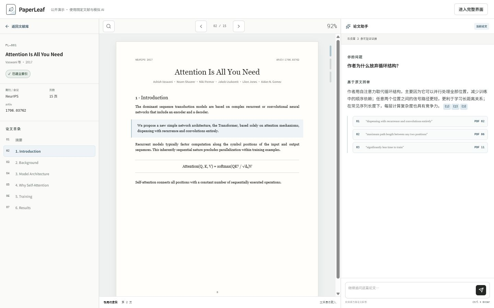
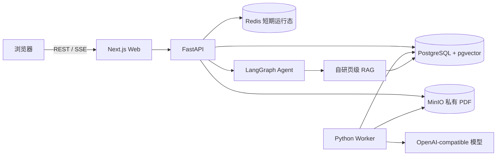

# PaperLeaf

PaperLeaf 是一个面向科研阅读的开源个人文献库。它把 PDF 保存、页级检索、带原文页码的问答、论文总结和结构图放在同一个工作台中，并通过受控 Agent 协调文库检索与 arXiv 搜索。

> 当前版本处于早期开发阶段。建议先在本机或受控网络中部署，并在升级前备份数据库与对象存储。

[在线体验固定数据 Demo](https://paperleaf-demo.chenlin1318.chatgpt.site/demo) · [查看部署指南](docs/deployment.md)



## 功能

- 上传、保存、查看、修改和删除 PDF 文献
- 以 PDF 为中心的阅读工作台，支持 50%～200% 缩放、适合宽度、独立收起双侧栏和专注阅读
- 后台逐页翻译已解析文本，当前页优先处理，并以“原始 PDF + 译文”双栏恢复阅读进度
- Zotero 式父子集合树、多集合归属、递归筛选、最近阅读、待整理和批量归档
- 自动识别标题、作者、年份、DOI 与出版物；本地缺失时仅用公开 DOI 查询 Crossref
- 文献列表、元数据编辑、处理状态和用户范围内的全文检索
- 按物理页解析与切块，回答附带可跳转的页码证据
- 向量检索、关键词检索与 RRF 融合，不依赖一键式 RAG Chain
- 混合候选按物理页去重并合并通道信号；弱匹配时明确提示证据边界，完全无证据时不伪装读过论文
- DeepSeek 等聊天模型负责综合检索证据并组织中文回答，不把英文摘要或原始 Chunk 当作模型失败时的替代答案
- 模型使用短引用别名，服务端再还原并核验真实 Chunk、论文和物理页；漏引段落不会进入最终消息
- 单篇、集合与全库问答共用可持久化会话，支持新建、重命名、删除与跨页面恢复；跨文献历史每 15 条分页
- 问答输入框按 Enter 发送、Shift + Enter 换行，并避免中文输入法选词时误发
- 提交问题后由 Worker 在后台执行 LangGraph；关闭页面或 SSE 断线不会取消任务
- 回答按完整事实段落完成引用校验后再保存为 SSE 增量，前端自适应逐字呈现；运行中的任务可主动取消
- Agent 事件持久化并支持 `Last-Event-ID` 补发；人工确认后可以恢复同一个运行
- 主/备用 OpenAI-compatible 服务统一经过超时、受控重试和按用途隔离的熔断器
- Redis 为多 API 实例提供 Agent 提交限流与幂等判定；故障时退回本机限流，不承载业务真相
- 管理员可查看 RAG 证据漏斗、召回通道、意图、失败分布和阶段 P50/P95；Prometheus/Grafana 提供本地趋势面板
- 搜索 arXiv，并在用户确认后导入开放 PDF
- 论文概览按研究问题、方法、实验、结果与局限生成结构化事实，并为每条事实保留页码证据
- 论文概括与研究结构图由 Worker 后台生成；离开阅读页不会取消任务，返回后自动恢复进度
- 研究结构图由模型生成 5～12 个语义节点，服务端校验节点引用、连通关系与无环结构后再渲染
- 总结、结构图和逐页译文持久缓存；重新生成失败不会覆盖上一次成功产物，论文重新索引后旧产物会明确过期
- 概括事实必须通过中文内容与页码引用校验；模型失败时只显示中文状态，不把英文原文 Chunk 冒充总结
- 管理员创建、停用用户并查看脱敏的模型运行状态；默认不读取用户文献内容
- 账户菜单提供真实昵称、邮箱、个人设置和退出登录；普通用户不会看到管理入口
- 应用内导航保留已验证的账户状态，页面切换时不会闪回未登录侧栏
- 个人设置持久保存小/标准/大字号、PDF 默认缩放、阅读器侧栏、翻译语言与 arXiv 搜索偏好
- 未配置模型时仍可使用文献管理和 PDF 阅读功能

当前 `0.8.x` 的[公开 Demo](https://paperleaf-demo.chenlin1318.chatgpt.site/demo)使用固定文献和确定性 AI 产物，便于在不上传文件、不配置模型的情况下检查工作流。`/demo` 会显式绑定固定数据源，并可继续进入带父子集合、出版物元数据和批量整理能力的演示文献库；跨文献提问会展示与真实 SSE 契约一致的 Agent 运行轨迹和回答核验状态。Docker Compose 构建固定使用 `real` 数据模式并连接 FastAPI。

## 快速开始

### 环境要求

- Docker Engine 24+ 与 Docker Compose v2
- 至少 4 GB 可用内存；处理大 PDF 或运行本地模型时需要更多资源

### 启动

```bash
git clone https://github.com/FrostWane/PaperLeaf.git
cd PaperLeaf
cp .env.example .env
```

Windows PowerShell 可使用：

```powershell
Copy-Item .env.example .env
```

打开 `.env`，至少替换以下值：

- `POSTGRES_PASSWORD`
- `MINIO_ROOT_PASSWORD`
- `PAPERLEAF_SESSION_SECRET`
- `PAPERLEAF_BOOTSTRAP_ADMIN_EMAIL`
- `PAPERLEAF_BOOTSTRAP_ADMIN_PASSWORD`

然后启动：

```bash
docker compose up -d --build
docker compose ps
```

访问：

- Web：<http://localhost:3000>
- API 健康检查：<http://localhost:8000/health>
- MinIO 控制台：<http://localhost:9001>
- Redis：仅在 Compose 私有网络中使用，无宿主机端口
- Prometheus：<http://localhost:9090>
- Grafana：<http://localhost:3001>

首次启动会自动执行数据库迁移、创建私有 PDF Bucket，并根据环境变量创建管理员。查看日志：

```bash
docker compose logs -f api worker web
```

## 配置 AI

PaperLeaf 使用 OpenAI-compatible 接口，既可以连接云端模型，也可以连接提供兼容接口的本地服务。核心变量如下：

| 变量 | 说明 |
|---|---|
| `PAPERLEAF_OPENAI_API_KEY` | 服务端 API Key；不要以 `NEXT_PUBLIC_` 开头 |
| `PAPERLEAF_OPENAI_BASE_URL` | 兼容接口根地址 |
| `PAPERLEAF_CHAT_MODEL` | 问答与总结模型 |
| `PAPERLEAF_EMBEDDING_ENABLED` | 当前服务是否提供 Embeddings；聊天服务不支持时必须关闭 |
| `PAPERLEAF_EMBEDDING_MODEL` | 向量模型 |
| `PAPERLEAF_EMBEDDING_DIMENSIONS` | 向量维度，必须与模型输出一致 |
| `PAPERLEAF_VISION_MODEL` | 可选；低文本页 OCR 使用的视觉模型 |
| `PAPERLEAF_FALLBACK_OPENAI_API_KEY` | 可选备用服务 Key；不配置则只使用主服务 |
| `PAPERLEAF_FALLBACK_OPENAI_BASE_URL` | 备用 OpenAI-compatible 根地址 |
| `PAPERLEAF_FALLBACK_CHAT_MODEL` | 备用问答与总结模型 |
| `PAPERLEAF_FALLBACK_EMBEDDING_ENABLED` | 备用服务是否提供 Embeddings |
| `PAPERLEAF_FALLBACK_EMBEDDING_MODEL` | 备用向量模型；输出维度必须与主模型一致 |
| `PAPERLEAF_MODEL_TIMEOUT_SECONDS` | 单次模型调用超时 |
| `PAPERLEAF_TRANSLATION_TIMEOUT_SECONDS` | 单页全文翻译超时，默认 90 秒 |
| `PAPERLEAF_ARTIFACT_TIMEOUT_SECONDS` | 后台全文概括首次生成超时，默认 120 秒 |
| `PAPERLEAF_ARTIFACT_RETRY_TIMEOUT_SECONDS` | 后台全文概括精简证据重试超时，默认 90 秒 |
| `PAPERLEAF_STRUCTURE_TIMEOUT_SECONDS` | 研究脑图首次生成超时，默认 180 秒 |
| `PAPERLEAF_STRUCTURE_RETRY_TIMEOUT_SECONDS` | 研究脑图精简证据重试超时，默认 120 秒 |
| `PAPERLEAF_MODEL_ATTEMPTS_PER_PROVIDER` | 每个服务最多尝试次数，范围 1~3 |
| `PAPERLEAF_MODEL_CIRCUIT_FAILURE_THRESHOLD` | 连续失败多少次后打开熔断器 |
| `PAPERLEAF_MODEL_CIRCUIT_COOLDOWN_SECONDS` | 熔断后的冷却时间 |

修改嵌入模型或维度后，需要对既有文献重新建立索引。未配置 API Key 时，生产环境不会把文献发送给任何模型：系统保留全文检索、引用校验和提取式产物，但不会生成向量、调用模型回答或执行视觉 OCR。

使用 DeepSeek 做论文问答时，可将 `PAPERLEAF_OPENAI_BASE_URL` 设为
`https://api.deepseek.com`、将 `PAPERLEAF_CHAT_MODEL` 设为当前可用的 DeepSeek
聊天模型，并设置 `PAPERLEAF_EMBEDDING_ENABLED=false`。聊天生成与向量检索是两项独立
能力：关闭向量调用后仍可通过 PostgreSQL 全文检索获得证据并交给 DeepSeek 回答；如需
语义向量检索，应另外配置支持 Embeddings 的服务并重建既有文献索引。

完整环境变量和生产部署注意事项参见[部署指南](docs/deployment.md)。

## 基本使用

1. 管理员登录后在“管理”页面创建普通用户；用户首次登录先修改临时密码。
2. 在左下角账户菜单进入“个人设置”，保存昵称、字号、PDF 缩放和 AI/翻译偏好；也可在这里退出登录。
3. 在“文献库”上传 PDF，等待状态变为“索引就绪”。
4. 创建父集合或子集合，把一篇论文加入一个或多个集合；点击父集合会递归显示全部后代文献，也可以批量归类或归档。
5. 打开文献，通过集中工具栏切页、缩放、适合宽度或收起两侧进入专注阅读；这些布局和缩放偏好会保存到账号。
6. 点击“翻译全文”核对页数与目标语言。Worker 会优先翻译当前页，离开页面后继续逐页处理；重新进入可恢复进度与已有译文。
7. 在阅读器右侧新建或恢复对话并提问；离开页面后任务仍会继续，返回后可以补发进度与回答，点击引用可跳转到对应物理页。
8. 在论文助手中切换“概览”或“结构”，提交后台任务；可离开页面，返回后会自动恢复带证据页的中文总结与 Mermaid strict mode 结构图。
9. 在左侧“文献设置”中修改元数据；解析失败或部分可用时可重新处理，删除操作需要二次确认。
10. 在“全库问答”中选择某个集合或全部文献；会话会保存当次服务端解析出的论文范围快照。
11. 在“发现”中搜索 arXiv；PaperLeaf 只会在确认后创建导入任务。

扫描版 PDF 需要配置视觉模型才能补充 OCR。未配置 OCR 时，原始 PDF 仍可保存和阅读，但检索覆盖可能不完整。

## 数据与隐私

- PDF 原件保存在私有 MinIO Bucket 中，不公开对象地址。
- 数据库保存文献元数据、页文本、检索块、向量、后台任务、问答会话、公开 Agent 事件、总结/结构图产物和 LangGraph Checkpoint。
- 模型 Key 只由 API/Worker 读取，不下发浏览器。
- 管理员负责账号和任务管理，默认没有读取用户 PDF 与提问内容的产品入口。
- 启用外部模型会把完成当前请求所需的文本证据或 OCR 页面图像发送给相应提供方，请结合其数据政策自行判断。
- 全文翻译只读取数据库中已经解析的单页文本，不修改原始 PDF，也不向模型开放工具、URL 或文件系统；目标语言固定在服务端白名单内。
- 出版物无法从 PDF 本地识别且存在 DOI 时，Worker 只把该公开 DOI 发送给 Crossref，不上传 PDF、标题、作者或正文。
- PaperLeaf 不用于绕过付费墙，只导入用户上传或允许来源中的开放文件。

部署者应配置 HTTPS、强密码、备份、最小化网络暴露和符合所在地区要求的数据保留策略。详细边界参见[安全说明](docs/security.md)。

## 当前限制

- V1 只内置 arXiv 搜索，不支持任意网页抓取。
- 暂不支持 Zotero 同步、RIS/BibTeX、团队协作批注和原生移动端。
- OCR、问答和向量质量取决于所配置模型。
- 引用校验可以降低伪造引用风险，但不能替代阅读原文和科研判断。
- 大型 PDF、复杂公式、双栏排版和扫描质量会影响解析效果。

## 本地开发与测试

前端：

```bash
corepack enable
pnpm install --frozen-lockfile
pnpm lint
pnpm typecheck
pnpm test
pnpm build
pnpm storybook:build
pnpm exec playwright install chromium
pnpm test:e2e
pnpm lighthouse
```

后端：

```bash
cd backend
python -m venv .venv
python -m pip install -e ".[dev]"
python -m compileall paperleaf_api tests
ruff check paperleaf_api tests
pytest
```

仓库另带自建冻结集与基于 QASPER 人工问题的“公开校准集 + 私有答案 holdout”，以及无需
模型密钥即可复现的哈希向量、BM25、RRF、页去重和拒答基线；可选依赖还可运行本地 ONNX
dense 与 Cross-Encoder 诊断。PDF 不随仓库重新分发。数据来源、许可、预注册锁、真实
分子/分母、未泛化的负向结果与指标边界见
[RAG 离线评测说明](backend/evaluation/README.md)。

容器配置：

```bash
docker compose --env-file .env.example config --quiet
# 启动服务并在 .env 中配置管理员后，可执行临时数据闭环
python scripts/smoke_compose.py
```

测试策略、场景与质量门禁参见[测试指南](docs/testing.md)。

## 架构



进一步了解数据流、权限边界和 Agent 设计，请阅读[架构说明](docs/architecture.md)。

## 文档

- [架构说明](docs/architecture.md)
- [部署指南](docs/deployment.md)
- [测试指南](docs/testing.md)
- [容量与可观测性里程碑](docs/scaling.md)
- [RAG 可观测性与指标口径](docs/observability.md)
- [RAG 离线评测](backend/evaluation/README.md)
- [安全说明](docs/security.md)
- [贡献指南](docs/contributing.md)
- [更新记录](docs/changelog.md)

## 参与贡献

欢迎提交可复现的问题、文档修正、测试和功能改进。提交代码前请先阅读[贡献指南](docs/contributing.md)，并确保前后端测试通过。

## 许可证

PaperLeaf 基于 [Apache License 2.0](LICENSE) 发布。依赖项和字体遵循各自许可证；仓库内自托管的 Geist 字体保留其 [SIL Open Font License 1.1](public/fonts/LICENSE-Geist.txt)。
