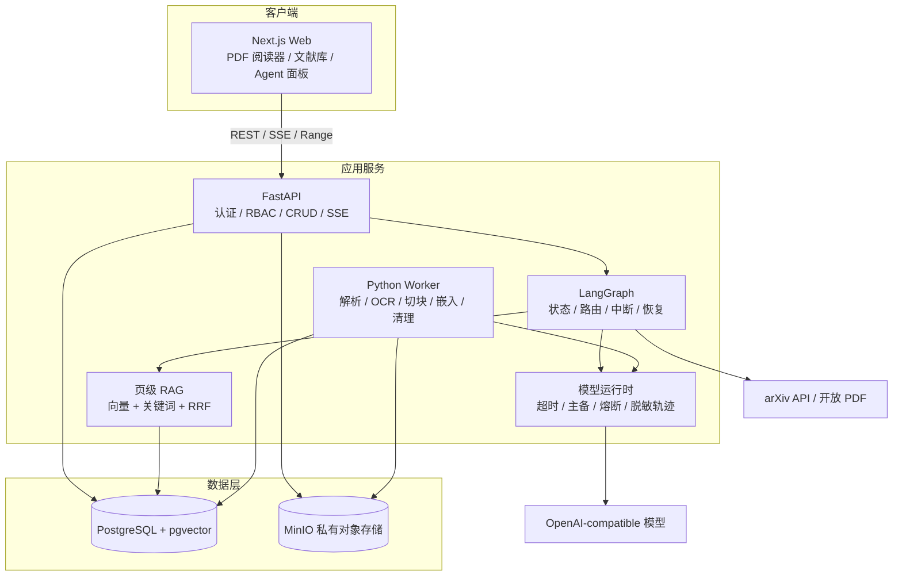
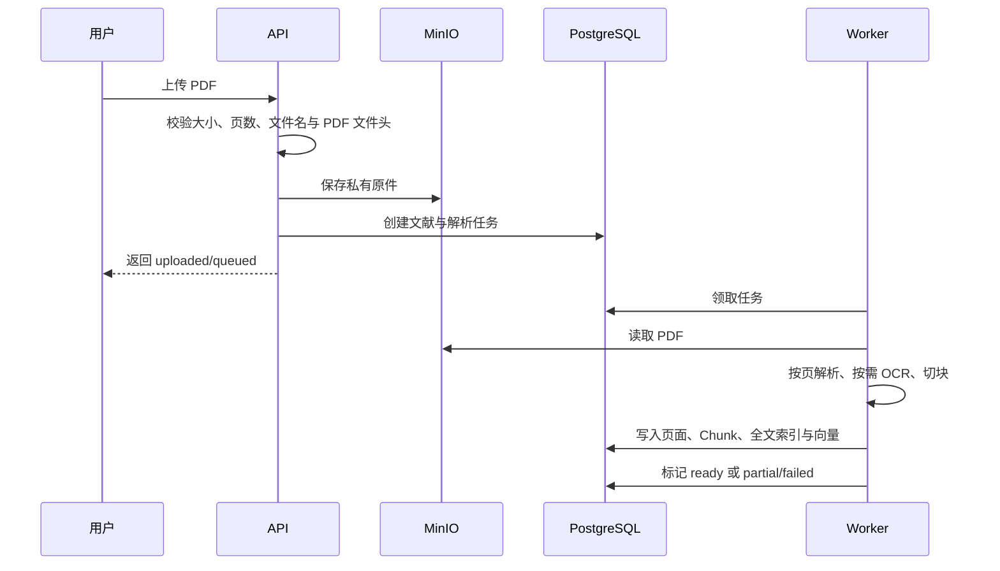

# PaperLeaf 架构说明

## 设计目标

PaperLeaf 把确定性的文献管理、可评测的检索链路和受控 Agent 分开。业务权限不交给模型判断，检索与引用不隐藏在框架内部，耗时任务不阻塞 Web 请求。

## 组件

### Web

- 提供文献列表、PDF 阅读、问答、发现、管理与设置页面。
- 使用 REST 处理业务操作，使用 SSE 接收回答增量、引用和可恢复动作。
- 只保存界面临时状态；权限判断以 API 为准。

### API

- 校验会话、CSRF、资源所有权、管理员权限和输入模型。
- 生成 PDF 的鉴权 Range 响应，不公开 MinIO Bucket。
- 创建后台任务和 Agent Run，不在请求线程中解析大 PDF。
- 将可公开的节点开始/完成、工具活动、耗时和错误码通过 SSE 返回，不输出隐藏推理。

### Worker

- 使用 PostgreSQL 作业表领取任务；任务设计为可重试和幂等。
- 按物理页解析 PDF，低文本页按配置进入 OCR。
- 建立全文与向量索引，清理删除中的文献及其派生数据。

### PostgreSQL 与 MinIO

- PostgreSQL 保存身份、文献元数据、集合、标签、页、Chunk、向量、任务、Agent Run 和 LangGraph Checkpoint。
- pgvector 负责精确向量检索，PostgreSQL 全文索引负责关键词检索。
- MinIO 保存 PDF 原件；Bucket 初始化为私有。
- 数据库记录对象键，不将预签名链接作为持久数据。

## 文献导入数据流

Chunk 不跨物理页，引用始终关联 `paper_id + page_number + chunk_id`。解析失败不会删除原始 PDF，用户仍可阅读并重试。

## RAG 数据流

1. API 固定用户与文献范围，并在查询前过滤资源所有权。
2. 向量召回与关键词召回独立执行，并保留各通道分数与命中来源。
3. RRF 合并候选后按 `paper_id + physical_page` 聚合；同一页的多个 Chunk 只占一个召回位，通道信号合并到页级证据。
4. 确定性质量门禁分别计算检索置信度、词项覆盖和通道一致性；“返回列表非空”不再等于证据充分。
5. 生成模型只能基于通过检索门禁的有限证据生成回答，并在每条事实主张后输出结构化 Chunk 引用。
6. 服务端先校验引用是否属于本次证据集合，再计算事实主张的引用覆盖率；没有合法引用的主张不能通过。
7. 回答生成后执行逐条证据支持检查：未配置检查模型时使用确定性的原文词项覆盖，已配置时再叠加结构化语义判定。模型检查只保存支持结论、置信度和原因码，不保存隐藏推理。
8. 全部检查通过后才补全论文标题、原文摘录和物理页跳转地址；证据不足、检查不可用、主张未覆盖或引用非法时拒答，而不是补写无来源内容。

`tool_finished` SSE 只向前端发送上述可公开的质量摘要，不发送思维链。该边界使切块、召回、页聚合、检索质量、答案支持、拒答和引用准确率可以分别测试。

## 模型运行时

问答、证据支持检查、论文总结、查询/文献嵌入和视觉 OCR 共用同一类运行策略，但按 `provider + purpose` 隔离故障状态：

1. 先调用主服务；可重试故障在配置的 1~3 次范围内重试。
2. 主服务失败或熔断时尝试备用服务；未配置备用服务时进入相应能力的确定性降级。
3. 每次调用由应用层统一设置超时，SDK 内建重试关闭，避免嵌套重试放大请求量。
4. 连续失败达到阈值后打开熔断器；冷却结束只允许一个半开探测，成功后关闭，失败则重新计时。
5. 用户取消会沿异步任务传播到当前 Graph 和模型调用，取消不会计入服务故障。

运行记录只包含用途、服务别名、模型名、成功/失败/超时/取消状态、尝试序号、耗时和稳定错误码。API Key、Base URL、提示词、证据正文、响应正文与隐藏推理均不进入公开轨迹。

## Agent 边界

当前 LangGraph 只编排以下受限工具：

- `search_library`
- `search_arxiv`

arXiv 下载由独立、鉴权且需要 CSRF 的导入接口完成；论文总结与结构图同样是独立的用户范围 API，不由模型自主调用。

当前图是有限无环路由，并在调用处设置递归上限 8。arXiv 候选在导入前中断并等待确认；实际下载由受控导入接口完成。模型没有 Shell、任意 URL、数据库或文件系统访问权，PDF 中的指令被当作文献内容而不是系统命令。

## 多用户隔离

- 文献、集合、标签和 Agent Run 的公开访问接口都校验当前用户。
- 查询服务在数据访问层加入用户范围，而不是检索后再过滤。
- 管理员接口与用户内容接口分离；管理员默认只管理账号和任务元数据。
- Agent Run 查询按 `run_id + user_id` 校验所有权；Checkpoint 线程 ID 由用户、会话与运行 ID 共同组成，避免跨用户或跨运行复用状态。

## 故障与恢复

- `migrate` 容器成功后 API 和 Worker 才启动。
- PostgreSQL 与 MinIO 使用健康检查和持久卷。
- 作业记录阶段、尝试次数和错误码；重复执行不应生成重复 Chunk 或对象。
- Agent Run 所有权、中断状态、节点轨迹与 LangGraph Checkpoint 均写入 PostgreSQL，API 重建后可按原运行 ID 恢复；其他用户访问同一 ID 仍返回 404。
- API 维护当前进程内运行任务表；取消接口先持久化取消状态，再向对应异步任务传播取消。重复取消返回同一结果，完成或失败的运行不能被改写为取消。
- 删除采用 `deleting` 状态和后台清理，避免部分删除对外可见。

## 扩展点

- 模型通过 OpenAI-compatible 适配器替换。
- 检索器与重排器保持独立接口，可用固定评测集比较。
- 新文献来源必须实现来源白名单、重定向复验、文件校验和用户确认。
- 对象存储可替换为兼容 S3 的服务，但必须保持私有访问语义。
