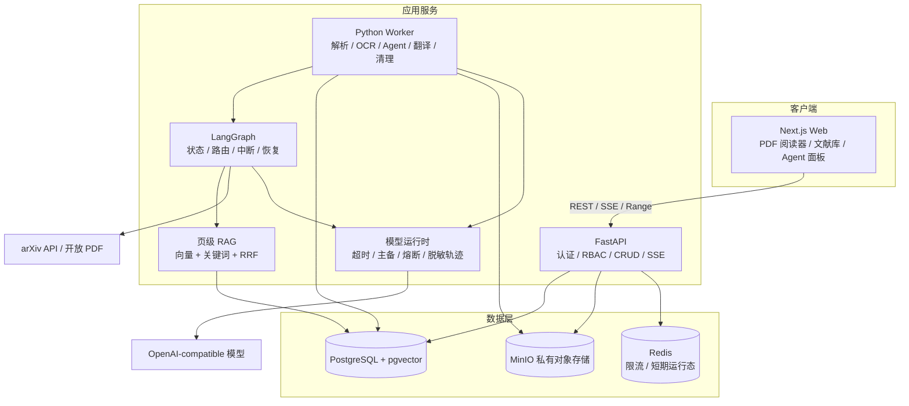
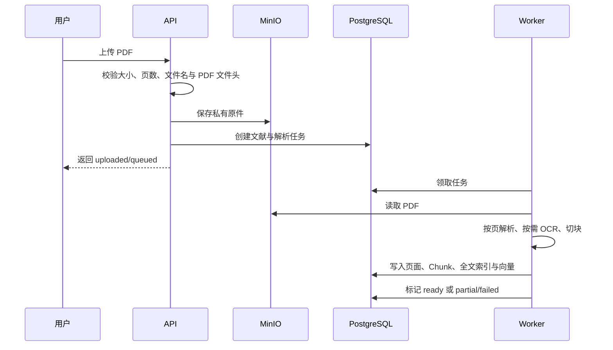
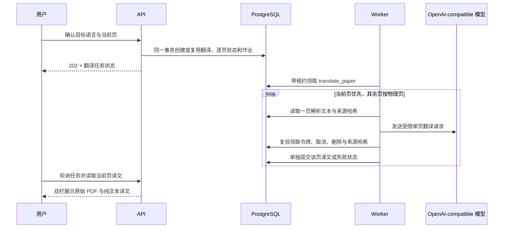
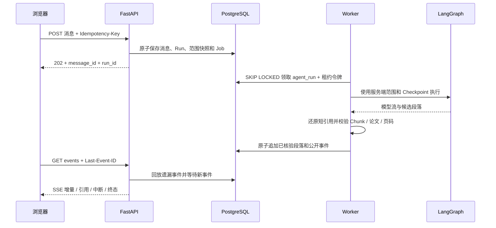

# PaperLeaf 架构说明

## 设计目标

PaperLeaf 把确定性的文献管理、可评测的检索链路和受控 Agent 分开。业务权限不交给模型判断，检索与引用不隐藏在框架内部，耗时任务不阻塞 Web 请求。

## 组件



### Web

- 提供文献列表、PDF 阅读、逐页双栏翻译、问答、发现、管理与设置页面。
- 发现页以最近使用的文献为轮换种子，优先使用摘要，缺失时读取已鉴权的代表 Chunk，与标题共同生成受控 arXiv 主题查询；候选先排除库内与历史已展示论文，再使用 Embedding 语义相似度和关键词重合排序。明确的兴趣反馈作为轻量内容偏好信号，感兴趣主题加权、不感兴趣主题降权；Embedding 不可用时确定性退回关键词排序。
- 使用 REST 处理业务操作，使用 SSE 接收回答增量、引用和可恢复动作。
- 根级账户状态只在内存中复用，应用内导航不会因页面组件重新挂载而闪回未登录状态；退出后立即清空。
- 从 `/auth/me` 获取真实身份和角色；普通用户界面不渲染管理入口，但权限判断仍以 API 为准。
- 昵称、字号、默认 PDF 缩放、阅读器侧栏、翻译语言与 arXiv 搜索偏好写入用户记录；页面临时状态仍只保存在客户端。

### API

- 校验会话、CSRF、资源所有权、管理员权限和输入模型。
- 提供当前用户偏好读取与部分更新接口；停用用户会撤销其现有会话，最后一名管理员和当前管理员由服务端给出明确拒绝原因。
- 生成 PDF 的鉴权 Range 响应，不公开 MinIO Bucket。
- 创建后台任务和 Agent Run，不在请求线程中解析大 PDF。
- 将可公开的节点开始/完成、工具活动、耗时和错误码通过 SSE 返回，不输出隐藏推理。

### Worker

- 使用 PostgreSQL 作业表领取任务；任务通过租约与领取令牌防止过期 Worker 写回，并设计为可重试和幂等。
- 按物理页解析 PDF，低文本页按配置进入 OCR。
- 按当前阅读页优先级翻译已解析文本；每页独立提交，已完成页不会因其他页失败而回滚。
- 建立全文与向量索引，清理删除中的文献及其派生数据。

### PostgreSQL 与 MinIO

- PostgreSQL 保存身份、文献元数据、层级集合、页、Chunk、向量、任务、Agent Run 和 LangGraph Checkpoint。
- 结构化总结和研究结构图通过 `summarize_paper`、`build_structure_graph` 作业交给 Worker；API 只负责幂等入队并返回 `processing`。
- 产物保存为用户私有 `paper_artifacts`；来源修订由全部物理页文本计算，重索引会使旧产物进入 `stale`。刷新生成期间继续保留上一次成功产物，失败不会覆盖它。
- pgvector 负责精确向量检索，PostgreSQL 全文索引负责关键词检索。
- MinIO 保存 PDF 原件；Bucket 初始化为私有。
- 数据库记录对象键，不将预签名链接作为持久数据。

### Redis 运行态边界

- Redis 只保存 Agent 提交的短期限流计数和幂等判定，所有 Key 使用前缀并哈希用户标识。
- 限流计数通过单段 Lua 脚本原子完成读取、递增、过期和判定，避免多个 API 实例超卖配额。
- Redis 不保存用户、会话、论文、消息、任务、Agent Run、Checkpoint、引用或 PDF 内容；这些数据仍以 PostgreSQL/MinIO 为真相源。
- Redis 不可用时 API 降级为当前进程内限流并在 `/ready` 标记 `degraded`，不会让短期缓存故障中断文献管理和已持久化任务。
- 当前 SSE 仍从 PostgreSQL 事件表补发；未来即使使用 Redis 加速唤醒，也不能绕过持久事件序列。

## 文献导入数据流



Chunk 不跨物理页，引用始终关联 `paper_id + page_number + chunk_id`。解析失败不会删除原始 PDF，用户仍可阅读并重试。

切分策略为版本化的 `structure_aware_v2`：Worker 先在单页内识别标题、空行、段落、句子、公式行和表格行，再把相邻短单元合并到 Token 目标范围。超长段落优先按完整句子滑窗，单句仍超长时才按 Token 滑窗，两层都保留受控重叠。边界选择完全确定，不调用 LLM 或 Embedding；Embedding 只处理最终 Chunk，因此向量服务不可用时全文检索和页码引用仍可用。

文档向量化保留 PaperLeaf 生成的原始 Chunk 字符串，不允许客户端再次按模型 Token 拆分，从而保持页码和稳定 Chunk ID。Worker 默认每批提交 8 个 Chunk，每批独立经过超时、熔断和主备路由；任一批失败时整篇不写入部分向量，全文检索仍然可用。

V1 固定窗口实现保留为 `chunk_pages_fixed_window`，只用于异常降级和离线对照。重新索引在同一事务中删除旧 Page/Chunk 后写入新稳定键 `{paper_id}:p{physical_page}:c{chunk_index}`，不会后台静默改写已有论文。

## 全文翻译数据流



- 顶层任务使用 `queued/running/partial/completed/failed/cancelled`；单页使用 `queued/running/completed/no_text/failed/cancelled`。
- 相同论文、来源版本和目标语言复用缓存；重新索引会立即把旧译文标记为来源已变化，不会静默复用。
- 用户从取消、部分失败或失败状态重新开始时复用唯一翻译与唯一 Job；若来源版本已变化，服务端会先清除旧页、旧领取令牌和旧来源哈希，再按最新 revision 重新排队。
- 取消请求持久化在数据库。Worker 在调用模型前、模型返回后和每页之间复验；取消保留已经成功的页面。
- 页面文本过长时仍在物理页内按段落分段，不跨页拼接；单页最多处理 48,000 个字符和 6 个分块，每块模型输出上限为 4,096 token。公式、引用编号和专有名词只作为翻译内容处理。

## 层级集合与出版物元数据

- 集合通过同表 `parent_id` 形成最多五层的用户私有树；同级名称唯一，API 拒绝跨用户父节点、循环和超深移动。
- 论文与集合保持多对多关系。父集合范围由服务端递归解析并去重，前端不提交后代论文 ID 作为权限依据。
- 删除集合只删除目标集合及其直接归属，直接子集合提升到原父级，论文和后代集合均保留。
- PDF 元数据识别先在本地完成。只有 DOI 已识别而出版物仍为空时，Worker 才向 Crossref 官方接口发送 DOI；查询在事务外执行，写回前重新锁定论文，避免覆盖用户同时修改的 DOI 或出版物。

## RAG 数据流

1. API 固定用户与文献范围，并在查询前过滤资源所有权。
2. 向量召回与关键词召回独立执行，并保留各通道分数与命中来源。
3. RRF 合并候选后按 `paper_id + physical_page` 聚合；同一页的多个 Chunk 只占一个召回位，通道信号合并到页级证据。
4. 确定性质量门禁分别计算检索置信度、词项覆盖和通道一致性；“返回列表非空”不再等于证据充分。
5. 生成模型综合有限证据组织回答，不得照抄英文摘要。证据偏弱时仍回答可支持的部分，并在结尾明确说明边界。
6. 提示词只向模型暴露 `E1`、`E2` 等运行内短别名；回答返回后由服务端还原为真实 Chunk ID，避免长 UUID 被模型截断，同时保证跨论文别名唯一。
7. 服务端按 Markdown 事实段落校验引用是否属于本次召回证据、论文和物理页。漏引或非法引用段落直接丢弃；存在召回证据时，最终消息至少保留一个合法引用段落。
8. 完全没有证据时允许模型给出帮助性说明或明确标注的一般知识，但不能声称读过当前论文；模型超时、鉴权或服务故障会返回明确错误，绝不把原始 Chunk 拼成伪 AI 回答。

`tool_finished` SSE 只向前端发送上述可公开的质量摘要，不发送思维链。该边界使切块、召回、页聚合、检索质量、答案支持、拒答和引用准确率可以分别测试。

## 持久问答与后台 Agent



- 会话分别绑定单篇论文、集合或全库。提交时由服务端递归解析可访问且已索引的论文 ID，并把结果写入 Run 范围快照；模型和前端都不能在执行中扩大范围。
- 同一会话只允许一个活动 Run。相同幂等键与相同请求只复用已受理结果，不重复创建消息、Run 或作业；相同键配不同请求会被拒绝。
- Agent 事件按 Run 内递增序号持久化。SSE 是可中断的观察通道，不拥有运行生命周期；页面关闭、路由切换和临时断线不会取消 Worker。

### Context Engine 与长期记忆

- 客户端可提交当前路由、论文、物理页和最多 4000 字的选中文字。服务端重新校验论文所有权、页码范围、选中文字哈希及其是否真实存在于对应页；单篇或集合会话不能借此扩大范围。
- 每个 Run 保存解析后的问题、指代来源与置信度、Token 预算、压缩前后用量和被选中的记忆 ID。低置信度指代只返回澄清问题，不启动检索或外部工具。
- Context Engine 按模型窗口预留输出和安全空间。超过阈值时保留最近六轮原始对话，把更早消息压成受控 JSON；原消息不改不删，Tool Call/Result 必须成对保留。
- 会话摘要和长期记忆只是理解上下文的缓存，提示中会明确标注“不可作为论文证据”。回答仍只能引用本轮从页级 Chunk 召回并通过所有权、物理页和引用门禁的证据。
- `memory_items` 是当前事实，`memory_item_versions` 保存用户修改产生的版本。只允许用户原话中的明确记忆、偏好和研究方向进入；assistant、论文文本和工具结果不能自动写入。
- 记忆选择先保留固定项，再结合关键词与可选 Embedding 排序，最多加载五条；Embedding 不可用时确定性降级为关键词。停用或删除的条目不会进入模型上下文。
- PostgreSQL 是会话、摘要和记忆的唯一事实源。记忆提取发生在回答终态事件之后，不延迟已核验内容的展示；Redis 后续只承担合并锁与短期缓存，不保存记忆正文。

### Skill Registry

- `paperleaf_api/skills/*.md` 保存版本化 YAML Manifest 与任务指令。服务启动时会校验名称、版本、允许工具、最大步骤、联网与审批策略；未知字段、未知工具或重复名称会直接阻止启动。
- 常驻上下文只暴露 Skill 名称、版本和一句描述。每轮选出一个主 Skill 后才加载其完整指令，避免把所有工作流一次性塞进模型上下文。
- 当前提供 `paper_qa`、`trace_original`、`compare_papers`、`find_related_papers`、`verify_claim`、`summarize_paper` 与 `build_research_map`。Run 会保存最终选择、版本、路由来源和置信度，但不保存隐藏推理。
- 多轮论文发现会在会话 `entity_state.active_task` 中保存可审计的任务名、数量、年份和排除已入库约束。“更近、换一批、2026 年”等续问会在 Skill 路由前恢复该状态；明确切换到解释、总结、实验或脑图时停止继承。
- Skill 关闭时仍走 `legacy_agent`；开启后先使用可复现的确定性保底路由。模型驱动路由与强类型工具循环由 Function Calling 里程碑接管，仍受同一 Manifest 权限约束。

### 受控 Function Calling

- 支持原生工具调用的模型先从精简 Catalog 选择一个主 Skill，再只能看到该 Skill 白名单中的 JSON Schema。模型参数中不存在 `user_id`、数据库连接或任意 URL；用户身份、论文范围和联网授权由服务端注入。
- Tool Registry 固定声明版本、输入模型、读写属性、超时、重试、幂等和审批策略。单次 Run 最多四个工具步骤；一批最多并行三个互不依赖的只读工具；非法参数只允许修正一次。
- `search_current_paper`、`search_library`、`get_page_text` 返回经过所有权复核的页级证据；arXiv 与 Crossref 只返回公开元数据，不能充当已读论文全文引用。工具结果始终以不可信数据交给后续模型。
- `request_import` 只会写入中断状态。用户批准后，Worker 才按服务端白名单和 arXiv ID 下载 PDF；模型提供的下载 URL 不会被使用。拒绝、重复 Resume、租约失效和取消都不会产生越权写入。
- 每次调用持久化到 `agent_tool_calls`。超过 8000 Token 的结果外置到用户隔离的 `agent_tool_artifacts`，当前上下文只保留短预览；Prometheus 和管理员聚合不记录原始参数或正文。
- Provider 没有原生 `tool_calls`、选出未知 Skill 或工具循环失败时，Harness 会记录降级原因并回退原固定 Graph，不通过自由文本猜测函数调用。
- 模型通过兼容接口内部流式返回，但未经核验的 token 只保留在 Worker 内存。完整事实段落通过引用来源检查后才追加到助手消息与 `message_delta` 事件，前端再用稳定的自适应字符步长逐步呈现。失败、取消和过期租约不能写入未经核验的尾部内容。
- arXiv 候选通过 `interrupt` 进入持久等待状态。批准或拒绝动作携带 `action_id`，相同决定可幂等重放；恢复后清除待确认动作并重新入队同一 Run。
- 取消请求先持久化。Worker 在节点和写入边界检查取消与租约；失去租约的旧 Worker 不能取消或覆盖后来领取者的结果。

### 有界跨文献并行比较

3～10 篇论文的集合或全库比较可以启用 `compare_map_reduce_v2`。它不是自由自治的 Agent Swarm，而是在单个父 `AgentRun` 内执行最多三个相互隔离的只读证据分支：

```text
服务端冻结范围与编排版本
→ 确定性 ResearchPlan（最多 3 个互斥论文子集）
→ 并行 Evidence Scout（仅调用用户范围内的文献库检索）
→ 服务端按 Chunk、论文和物理页复验、去重与轮转选证
→ 现有 LangGraph 回答生成
→ 引用合法性与语义支持门禁
```

- Coordinator 只分配目标、论文子集、比较维度和预算，不读取论文正文，也不陈述事实。
- Scout 没有联网、导入、删除、Memory 写入或审批权限；其返回的描述不作为最终证据，只有重新通过服务端范围检查的 `Evidence` 能进入回答。
- 分支限制为最多 3 个，单分支和父任务分别设置超时与 Token 预算。用户取消或 Worker 失租会取消仍在运行的只读检索。
- 部分分支失败时保留成功证据并公开覆盖边界；全部失败、计划无效或超时则回退原有标准检索。
- Run 创建时冻结 `orchestration_version`，Checkpoint 使用版本命名空间。Phase 1 只保证父 Run 可重试；外层分支在 Worker 崩溃后会安全重跑，不承诺分支级 Checkpoint 或 exactly-once。
- SSE 只公开 `s1`～`s3`、状态、计数与耗时，不公开问题、论文 ID、Chunk ID、分支提示或隐藏推理。管理员只看到低基数聚合。

该能力通过 `PAPERLEAF_MULTI_AGENT_ENABLED` 控制。关闭后新 Run 继续使用 `single_agent_v1`；单篇问答、上传解析、翻译、总结和写操作始终保持原确定性链路。

### 有界 Specialist 多 Agent 子图

`specialist_subgraph_v3` 在 Phase 1 的分组检索之上增加真正隔离的模型 Specialist。它仍只服务于 3～10 篇论文的复杂跨文献比较，并与普通 Agent 主链分开：

- 唯一 Coordinator 只根据可信论文描述拆分最多三个任务，不读取正文；进入 v3 后不再调用 Function Tool planner。
- LangGraph `Send` 为每个 Specialist 创建独立输入；分支只含自己的任务、论文别名和 `E1…En` 证据，不含会话历史、Memory 或兄弟结果。
- 自定义字典 reducer 可交换、结合且幂等，分支完成顺序和同代重放不会改变确定性合并结果。
- 父 Research Graph 与每个 Specialist 分别使用独立 PostgreSQL Checkpoint thread；即使 Worker 在 `Send` 屏障完成前退出，新 Worker 也只重跑未完成分支。最终回答继续使用版本化 Checkpoint。
- Specialist 主张不能直接成为 Citation。Merger 只接收服务端 Retriever 返回的 Evidence，并再次复核 Chunk、论文范围和物理页，再以论文轮转方式限制最终证据。
- Specialist 输出包含稳定 `claim_key`、`support / contradict / unclear` 立场、置信度和证据别名。Reducer 不覆盖相反立场，Merger 形成 `ConflictSet`，综合器按论文和实验条件并列呈现冲突。
- Synthesizer 使用不含聊天历史和长期记忆的独立综合上下文；回答仍通过既有引用合法性和分批语义支持核验。
- 单支失败可形成带覆盖说明的部分结果；全部失败、计划非法、综合失败或预算不足时直接走标准检索。
- 分支观测记录耗时、估算 Token、可用的 Provider Token、证据数、主张数与错误分类；聚合层记录论文覆盖、去重、冲突、合并和最终核验延迟，不收集问题、论文 ID、Chunk ID 或主张正文。

该能力通过默认关闭的 `PAPERLEAF_SPECIALIST_AGENTS_ENABLED` 灰度。它是有界多 Specialist 协作，不是自由通信的 Agent Swarm；每个 Specialist 仍只读取服务端预检索的有界证据，暂不开放完整工具循环。完整冻结集 A/B 与人工盲评通过前不声明优于 v1/v2。详细取舍见 [ADR 0021](decisions/0021-bounded-specialist-subgraph.md)。

### 学术 MCP Gateway

- `academic-search-mcp` 是 Compose 私网内的独立只读服务，只访问 OpenAlex 与 Semantic Scholar 固定官方 API；模型和普通用户不能提交 Server URL 或任意网页地址。
- API/Worker 通过 Gateway 完成工具发现、Schema 与只读标注校验、名称规范化、连接池、超时、重试边界、Redis 15 分钟缓存、健康状态和连续失败熔断。未知工具、可破坏工具、异常 Schema 和非白名单主机默认拒绝。
- MCP 结果会限长、清洗脚本协议与内网链接，并作为“不可信外部元数据”进入模型；它不会转换成页级 `Evidence`，不能生成 PaperLeaf 物理页引用。
- 搜索顺序保持“当前页 → 当前论文 → 当前集合 → 全库 → arXiv → 学术 MCP”。用户打开联网学术搜索后，相关论文发现若未指定来源，会由 Harness 确定性保留一次 OpenAlex 查询，再允许模型在总计四步内补充本地、arXiv 或 Semantic Scholar；明确指定来源时按该来源检索。普通论文问答仍只在本地证据不足或用户明确要求联网时调用外部工具。
- `mcp_server_configs` 保存管理员启停、健康与熔断状态，`mcp_tool_snapshots` 保存经过校验的工具清单。API Key 只从服务端环境注入，数据库和管理页面均不返回 Key。

## 证据化产物

- 总结模型只能输出固定五节 JSON：研究问题、核心方法、实验设置、主要结果、局限与适用范围。每个事实独立携带引用数组，服务端校验 Chunk 所有权和物理页后生成 Markdown。
- 结构图模型输出 5～12 个受控语义节点和边。提示词只暴露 `E1/E2` 短证据别名，服务端映射回真实 Chunk 后再检查节点类型、引用、未知端点、孤立节点与有向环。首次拓扑不合法会用紧凑上下文重试；第二次若节点、中文摘要和引用都合法而仅拓扑不完整，服务端按语义类型归一为从研究问题出发的无环完整链，再生成经过字符约束的 Mermaid `flowchart TD`。前端仍使用 strict 安全模式渲染。
- 模型超时或 JSON 格式错误会使用更小上下文重试，作业还可由 Worker 按租约恢复。总结事实必须含中文且引用合法；结构图节点摘要也必须含中文。
- 首次生成最终失败时只保存中文失败原因和空产物，不保存或展示英文 Chunk 摘录。刷新生成失败时继续返回上一次成功的中文产物，不用原文摘录或 Chunk 顺序连线伪装模型结果。
- 产物以 `paper_id + type` 唯一保存，记录来源修订、状态、结构化 payload、稳定 Markdown 和降级原因。只有来源修订一致的 ready 产物可直接复用。

## 模型运行时

问答、证据支持检查、论文总结、全文翻译、查询/文献嵌入和视觉 OCR 共用同一类运行策略，但按 `provider + purpose` 隔离故障状态：

1. 先调用主服务；可重试故障在配置的 1~3 次范围内重试。
2. 主服务失败或熔断时尝试备用服务；未配置备用服务时进入相应能力的确定性降级。
3. 每次调用由应用层统一设置超时，SDK 内建重试关闭，避免嵌套重试放大请求量。
4. 连续失败达到阈值后打开熔断器；冷却结束只允许一个半开探测，成功后关闭，失败则重新计时。
5. 用户取消会沿异步任务传播到当前 Graph 和模型调用，取消不会计入服务故障。

运行记录只包含用途、服务别名、模型名、成功/失败/超时/取消状态、尝试序号、耗时和稳定错误码。API Key、Base URL、提示词、证据正文、响应正文与隐藏推理均不进入公开轨迹。

## Agent 边界

当前 LangGraph 只编排以下受限工具：

- `search_library`
- `search_arxiv`

arXiv 下载由独立、鉴权且需要 CSRF 的导入接口完成；论文总结与结构图同样是独立的用户范围 API，不由模型自主调用。

发现推荐只向 arXiv 发送服务端清洗后的主题短语，不发送 PDF 文件或全文。`discovery_batches` 与 `discovery_items` 保存每个用户最后一批推荐及反馈状态；普通进入直接恢复最近批次，只有显式“换一批”才轮换种子、推进 arXiv 偏移并排除服务端保存的历史曝光 ID。

推荐条目幂等记录首次查看来源、当前兴趣反馈和成功导入时间。管理端按 24 小时、7 天或 30 天聚合曝光、点击、反馈与导入漏斗，不暴露用户、论文正文或个人推荐列表。点击率为独立查看数/曝光数；兴趣命中率为感兴趣数/明确反馈数。

个性化发现受用户偏好 `arxiv_search_enabled` 的前后端双重门禁保护，默认关闭。未开启时前端不请求推荐接口，后端也拒绝直接调用，并为个性化响应设置 `private, no-store`，避免跨会话复用私人推荐结果。

当前图是有限无环路由，并在调用处设置递归上限 8。arXiv 候选在导入前中断并等待确认；实际下载由受控导入接口完成。模型没有 Shell、任意 URL、数据库或文件系统访问权，PDF 中的指令被当作文献内容而不是系统命令。

## 多用户隔离

- 文献、集合和 Agent Run 的公开访问接口都校验当前用户。
- 管理导航的前端隐藏只是体验优化，管理员接口仍逐次校验当前会话角色；退出登录会删除服务端会话并清理认证 Cookie。
- 查询服务在数据访问层加入用户范围，而不是检索后再过滤。
- 管理员接口与用户内容接口分离；管理员默认只管理账号和任务元数据。
- Agent Run 查询按 `run_id + user_id` 校验所有权；Checkpoint 线程 ID 由用户、会话与运行 ID 共同组成，避免跨用户或跨运行复用状态。

## 故障与恢复

- `migrate` 容器成功后 API 和 Worker 才启动。
- PostgreSQL 与 MinIO 使用健康检查和持久卷。
- 作业记录阶段、尝试次数和错误码；重复执行不应生成重复 Chunk 或对象。
- 作业领取记录租约时间和随机令牌。每个模型分块前后都会检查并续租；已经过期的 Worker 不能复活自己的租约，也不能继续调用模型或写回结果。单次模型超时最多 120 秒，显著短于 30 分钟作业租约；翻译页按瞬态/永久错误分类重试并退避。
- 问答会话、消息、Agent Run、公开事件、中断状态、范围快照与 LangGraph Checkpoint 均写入 PostgreSQL，API 或浏览器重建后可按原运行 ID 恢复；其他用户访问同一 ID 仍返回 404。
- Worker 使用作业租约执行 Agent。取消接口持久化取消状态，执行者在安全边界停止 Graph 与模型调用；重复取消保持幂等，完成或失败的运行不能被改写为取消。
- 删除采用 `deleting` 状态和后台清理，避免部分删除对外可见。

## 扩展点

- 模型通过 OpenAI-compatible 适配器替换。
- 检索器与重排器保持独立接口，可用固定评测集比较。
- 新文献来源必须实现来源白名单、重定向复验、文件校验和用户确认。
- 对象存储可替换为兼容 S3 的服务，但必须保持私有访问语义。
- 容量演进、观测指标和消息队列触发条件见[容量与可观测性里程碑](scaling.md)。
